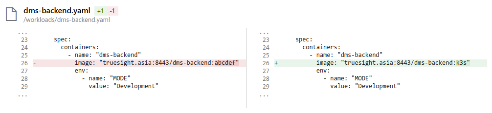

k3s-ci
------
_Simple CI tool for K3S_


## Usage

```sh
Usage: k3s-ci [options] [command]

Options:
  -V, --version                       output the version number
  -f, --workload-file <workloadFile>  Workload file
  --repository <repository>           Repository URL
  -b, --branch <branch>               Branch to clone (default: "master")
  -u, --username                      Git username
  -p, --password                      Git password
  -e, --email                         Git email
  -h, --help                          display help for command

Commands:
  patch <commitID>
  help [command]                      display help for command
```

## Git config
There are 2 options to specify git config:

1. Using CLI options: `-u, -p, -e`

2. Using `.env` file:
  ```env
  GIT_USERNAME=
  GIT_PASSWORD=
  GIT_EMAIL=
  ```


